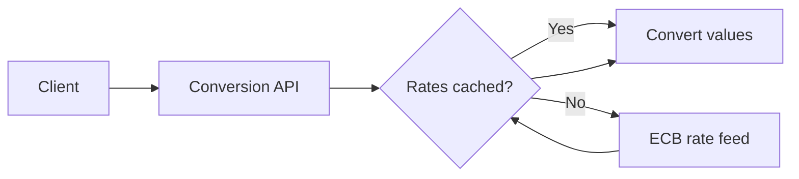

# Currency Conversion API

An ASP.NET Core service for converting batches of monetary values using the European Central Bank's daily reference rates.

The project focuses on external-service integration, cache behavior, graceful fallback, dependency injection, and automated tests.

## Highlights

- ASP.NET Core API on .NET 10
- Batch conversion between supported currencies
- ECB XML feed integration through `HttpClient`
- 24-hour in-memory cache
- Explicit rate refresh endpoint
- Cached-rate fallback when the ECB feed is unavailable
- Unit tests with xUnit, Moq, and MockHttp

## Conversion flow



ECB rates use EUR as their base. The service adds `EUR = 1` and converts between two currencies through their relative rates.

## Endpoints

| Method | Endpoint | Purpose |
| --- | --- | --- |
| `POST` | `/api/currencyconverter/convert` | Convert a batch of values |
| `POST` | `/api/currencyconverter/update-rates` | Force a rate refresh |

Example request:

```json
[
  {
    "fromCurrency": "USD",
    "toCurrency": "EUR",
    "amount": 100
  }
]
```

Invalid currency codes produce a `400 Bad Request` response listing the unsupported values.

## Cache and resilience

Rates are kept in process memory for 24 hours. A forced update bypasses the normal cache read.

If fetching or parsing the ECB feed fails:

1. the error is logged;
2. an existing cached rate set is returned;
3. if no cached rates exist, the service raises a conversion exception.

This is a stale-cache fallback, not persistent disaster recovery. Restarting the process clears the cache.

## Running locally

Requirements:

- .NET 10 SDK
- Internet access to the configured ECB endpoint

```bash
git clone https://github.com/Esphios/CurrencyConversionAPI.git
cd CurrencyConversionAPI
dotnet restore
dotnet build --configuration Release
dotnet run --project CurrencyConversionService
```

The ECB URL is configured at `CurrencyConverter:EcbRatesUrl` in `appsettings.json`.

## Tests

```bash
dotnet test --configuration Release
```

The test project uses xUnit v3, Moq, MockHttp, and Coverlet.

## Known limitations

- The cache is local to one process and is not shared across replicas.
- Cached data is lost when the process restarts.
- The refresh endpoint is not protected by authentication.
- Batch items are converted sequentially.
- ECB reference rates are not real-time trading rates.

## License

Distributed under the MIT License. See [`LICENSE`](LICENSE).
